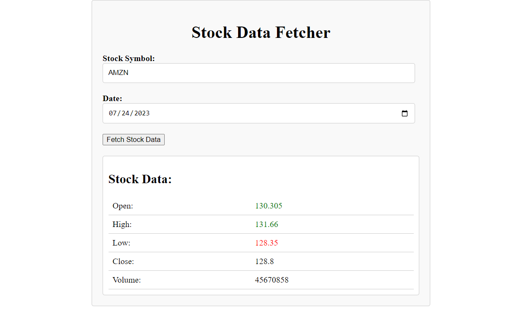

## Stock Price Fetcher in ReactJS, NodeJS and Polygon API

This project uses Polygon API to fetch stock statistics for a particular stock on a particular date.
Stock data is displayed in a responsive UI. 
Appropriate errors, if any, are shown with proper formatting. 
Errors are handled in client and server code. 
Stock symbol input is automatically converted to Capital case as per polygon API requirements. 
Calendar input is only allowed for dates before today (excluding today) as as per polygon API requirements. 

### Naming Convention

Pascal case for components and style sheets. 
Camel case for variables. 

### Project Structure

server/app.js contains server code  
React components are added in client/src/components and corresponding styling in client/src/styles 

### Steps to run the project -

1. install dependencies in 'client' and 'server' folder using 'npm install' 
2. run 'npm run start' in both 'client' and 'server' folders 

### Screenshot

### Extras

#### Improving UX :

1. Performance Optimization -
   - using server side caching for most frequently fetched stock infos.
   - using CDN for static assets, minimization for js and css.
   - serverless/scalable architecture to handle spikes
2. Responsive design
3. Data visualization - showing charts instead of plain numbers.
4. Search for stock symbols, autocomplete feature.
5. Realtime updates to numbers/charts

#### More possible feature additions:

1. Technical analysis indicators -
   - these will better help users gain insights (adding charts instead of just numbers is a prerequisite)
2. Allow users to compare current prices with historical prices
3. Alerts to users on price changes
4. Social media integration, user forums
5. Latest stock updates and educational resources
